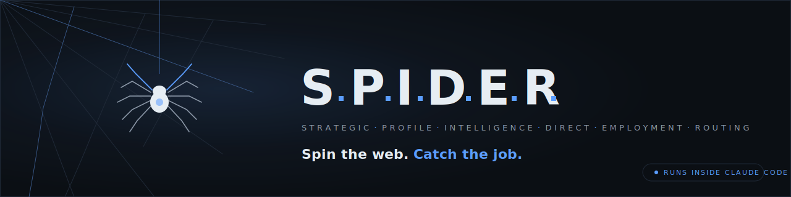

<div align="center">



**Strategic Profile Intelligence & Direct Employment Routing**


&nbsp;
&nbsp;
&nbsp;
&nbsp;

**Your entire job search, run by an agent that doesn't make things up.**
From your LinkedIn export to tailored applications and interview prep — one command, zero fabrication.
Works for any field: engineering, design, product, marketing, ops.

[**▶ See a full fictional run**](examples/sample-run/) &nbsp;·&nbsp; [Quickstart](#quickstart) &nbsp;·&nbsp; [How it works](#how-it-works) &nbsp;·&nbsp; [Setup for non-coders](docs/SETUP.md)

</div>

<!-- DEMO: record a 10–15s clip of `/spider` → intake → a phase completing → opening start-here.html.
     Export GIF ≤8MB ≤1200px wide → commit to assets/demo.gif → replace this comment with:
     <div align="center"></div>
     Until then, the fictional examples/sample-run/start-here.html is the "see it" link above. -->

---

## Quickstart

```bash
git clone https://github.com/koushik1610/spider.git
cd spider
# Unzip your LinkedIn export; note the folder path + your resume's path.
claude          # open Claude Code in this folder
```

Then type **`/spider`** (or *"Run SPIDER"*). It interviews you — name, where your LinkedIn export and
resume are, what jobs you want — builds a private `workspace/<your-name>/`, and runs the pipeline,
checking in after each step. When it's done, open **`workspace/<your-name>/start-here.html`**.

> New to terminals? **[`docs/SETUP.md`](docs/SETUP.md)** walks through it step by step.
> Want to sample it cheaply first? Say *"Run SPIDER Phase 1"* (just the LinkedIn analysis).

---

## What you get

| Output | What it is |
|---|---|
| **`linkedin-analysis.html`** | A visual audit of your LinkedIn presence (findability score, keyword gaps, network, activity) **+ 10 ranked next steps** to grow reach and recruiter exposure. |
| **`master-resume.md`** | Your superset resume — every achievement, tagged, with a metrics bank. Every per-job resume is *selected* from it, never rewritten. (The ATS/keyword audit is folded in.) |
| **`job-queue.md`** | 15+ ranked candidate jobs matched to your profile, each link fetched and marked verified/unverified (postings rot — you re-open before applying). |
| **`jobs/<NN-company-role>/`** | A tailored **apply pack** per job you pursue — résumé, referral-first outreach, application log. Deep interview prep is generated **on demand** when a screen gets booked. |
| **`interview-packet/`** | Cross-job prep reused everywhere: STAR stories, positioning hooks, metrics cheat-sheet. |
| **`start-here.html`** | The front door — a dashboard with your weekly action loop, application scoreboard, and every job. **Open this first.** |

Everything lands in `workspace/<your-name>/`, which is **gitignored** — it never leaves your machine.

---

## How it works

```
  Phase 0  Intake interview ............ asks your name, data location, targets
     │
  1  LinkedIn analysis ........ linkedin-analysis.html  (+10 next steps)
  3  Master resume ............ master-resume.md  (resume audit folded in)
  4  Job search ............... job-queue.md  (15+ ranked candidates)
  6  Interview packet ......... interview-packet/  (thin; enriched on demand)
  5  Apply packs .............. jobs/<NN>/  (résumé · outreach · log — top 3–5 you commit to)
  7  Navigator ................ start-here.html

  On demand:
  prep <NN>  Deep interview prep when a screen books ...... 10-deep-prep.md
  export     Résumé → ATS-safe PDF ......................... 08-export-pdf.md
  maintenance Weekly refresh, follow-ups, retros ........... 09-maintenance.md
```

**Lazy by design.** A first run produces **~25–30 files** — a master resume, a 15-job queue, a thin
packet, and a 3-file apply pack for the few jobs you commit to — *not* 100 speculative prep files for
leads that never call back. Deep interview prep is built per job, exactly when it converts. A run
manifest (`.spider-state.json`) makes everything **resumable** — close your laptop mid-run, say *"Run
SPIDER resume"* later.

<details>
<summary><b>🕸️ the ASCII spider, for the terminal-romantics</b></summary>

```
        |
      \ | /
   ----(•)----     S.P.I.D.E.R.
      / | \        find · tailor · apply · prep
        |
```
</details>

---

## Day-to-day (in Claude Code)

| Say this | What it does |
|---|---|
| `/spider` / "Run SPIDER" | Full run from the intake interview |
| "Run SPIDER Phase 1" | Just the LinkedIn analysis (cheap first taste) |
| "Run SPIDER resume" | Resume an interrupted run where it stopped |
| "SPIDER today" | Your action list: packs to send, referrals to ask, follow-ups due |
| "SPIDER job add \<url>" | Add + build an apply pack for a job you found |
| "SPIDER prep 03" | Build deep interview prep for job #3 (when a screen books) + mock drill |
| "SPIDER score \<paste a JD>" | ATS gap score + missing keywords, no files built |
| "SPIDER export Acme" | Turn a job's résumé into an ATS-safe PDF |
| "Run SPIDER maintenance" | Weekly: new/closed jobs, follow-ups due, retro patterns |

**The objective is action, not paperwork.** The dashboard leads with a weekly *apply N / ask N
referrals* loop and a funnel scoreboard — applications sent and referrals asked are what get you
interviews; tailored documents are just the ammunition.

---

<details>
<summary><b>Costs, runtime & requirements</b></summary>

- **You need a Claude subscription / API access** — this runs inside Claude Code and uses tokens.
- **A full run is long:** live web research for 15+ roles + the generated files often means **1–3+
  hours** of Claude working, across several check-ins. Sample it first ("Run SPIDER Phase 1", or "only
  find 3 jobs and build apply packs for 2").
- **The PDF step is automated** (`08-export-pdf`), but you press "Save as PDF" once and eyeball it.
- **Platform:** developed on macOS; works on Linux; on **Windows** use WSL or Git Bash (see
  [`docs/SETUP.md`](docs/SETUP.md)).
- **See output for free:** open the fictional [`examples/sample-run/start-here.html`](examples/sample-run/).
</details>

<details>
<summary><b>Privacy &amp; honesty</b></summary>

**Privacy.** Everything personal lives in `workspace/<name>/` and is **gitignored** — your LinkedIn
export, résumés, job folders, and dashboards are never committed. The `.gitignore` also blocks
résumés and LinkedIn CSVs anywhere in the tree as a backstop, and both dashboards carry a "contains
personal data — keep it local" banner. Run it for more than one person and each gets their own
`workspace/<name>/`; delete a folder to wipe that person entirely.

**Honesty.** SPIDER never fabricates. Every claim traces to your LinkedIn export, your résumé, or an
answer you gave — no invented metrics, titles, certs, skills, or referral contacts. A role wants
something you don't have? That's a **gap with honest handling**, not a bluff. Personal "why this
company" essays come out as honest *outlines* for you to write in your voice — never as finished prose.
Job links are fetched and marked verified/unverified; req IDs are never invented. Full policy:
[`reference/number-and-honesty-policy.md`](reference/number-and-honesty-policy.md).
</details>

<details>
<summary><b>FAQ</b></summary>

**Do I need an Anthropic/Claude subscription?** Yes — you run this inside Claude Code.

**Will it apply to jobs for me?** No. It finds jobs, builds your materials, and preps you. You review,
export the PDF, and submit — applying for you would violate most sites' terms and skip your judgment.

**Are the job links real?** Phase 4 fetches each link and marks it verified/unverified/dead, and never
fabricates req IDs. Job boards block automated checks and postings rot, so the queue reports an honest
split (*N candidates, M link-verified*) and you re-open every link before applying.

**Can it run without a résumé?** Yes — it builds the master résumé from your LinkedIn export + intake.

**Is my data sent anywhere?** Only to Claude as part of running the pipeline (like any Claude Code
session). Nothing is committed to git; nothing is published.

**Can I customize it?** Yes — edit anything in `prompts/`, `templates/`, or `reference/`.
</details>

<details>
<summary><b>Repo map</b></summary>

```
spider/
├── README.md · START-HERE.md · CLAUDE.md · CONTRIBUTING.md · CHANGELOG.md · LICENSE (MIT)
├── .gitignore                       privacy backstop (ignores all personal data + output)
├── .claude/commands/spider.md       the /spider slash command
├── assets/spider-banner.svg         the brand banner (+ a slot for a demo.gif)
├── docs/SETUP.md                    non-technical, step-by-step first-run guide
├── prompts/                         00-orchestrator + phases 01–07, 08-export, 09-maintenance, 10-deep-prep
├── templates/                       job-folder (tiered spec), master-resume, signal, job-queue,
│                                    interview-packet, resume-print, linkedin-analysis.template.html,
│                                    start-here.template.html
├── reference/                       binding rules: ATS/keywords, résumé writing, numbers/honesty,
│                                    interview-prep framework
├── examples/sample-run/             a fictional end-to-end example (open its start-here.html)
└── workspace/                       YOUR private output lands here (gitignored)
```

See [`CONTRIBUTING.md`](CONTRIBUTING.md) to add field packs, polish the dashboards, or fix prompts.
</details>

---

<div align="center">

**MIT** — see [`LICENSE`](LICENSE). Use it, fork it, run it for your friends and family. 🕸️

</div>
