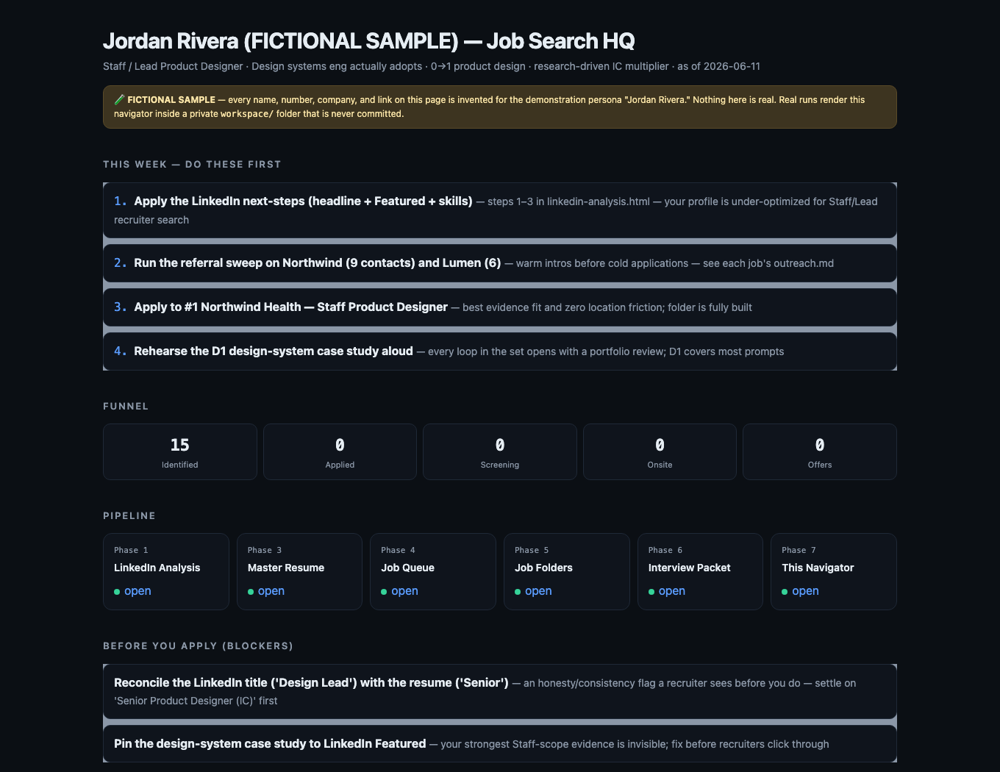
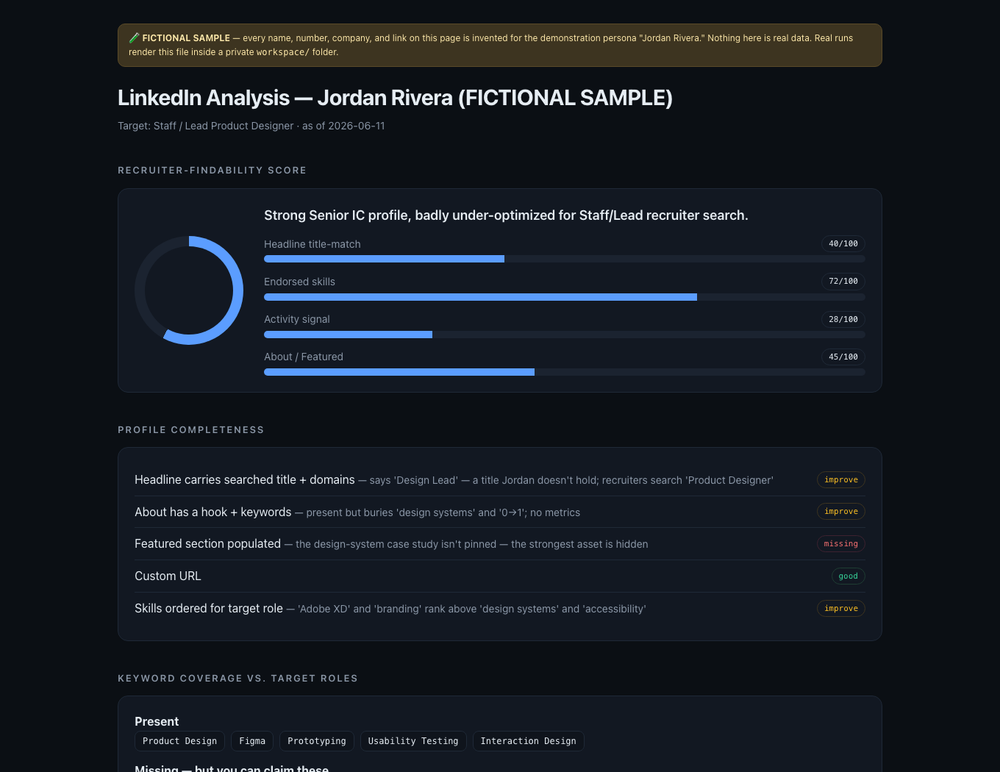

<div align="center">


# The job-search agent that can't make things up

**Point it at your LinkedIn export. Get a ranked queue of live jobs, a tailored one-page PDF per
application, referral-first outreach, and interview prep. Every claim traces to your real history.**


&nbsp;
&nbsp;
&nbsp;

[**See a full fictional run**](examples/sample-run/) · [Quickstart](#quickstart) · [How it works](#how-it-works) · [How people use it](WORKFLOW.md) · [Non-coder setup](docs/SETUP.md)

</div>

<!-- DEMO: record a 10–15s clip of `/ascend` → intake → a phase completing → opening start-here.html.
     Export GIF ≤8MB ≤1200px wide → commit to assets/demo.gif → replace this comment with:
     <div align="center"></div> -->

Job hunting with AI has a trust problem: generic ChatGPT résumés are the new typos, and recruiters
flag them on sight. Ascend takes the opposite bet. It builds everything from **your** LinkedIn
export, **your** résumé, and **your** answers, then runs a linter that mechanically blocks invented
numbers, retracted claims, and AI-tell language before anything is called done. A missing skill
becomes an honest gap with a plan. Never a bluff.

It runs entirely inside [Claude Code](https://claude.com/claude-code) on your machine. Your data
lands in a gitignored `workspace/`, and nothing about you is ever committed.

## What it looks like

Two of the dashboards it builds, from the committed fictional sample (open them yourself in
[`examples/sample-run/`](examples/sample-run/), no install needed):

| `start-here.html`, your home base | `linkedin-analysis.html`, the profile audit |
|---|---|
|  |  |

## Quickstart

```bash
git clone https://github.com/koushik1610/ascend.git
cd ascend
claude        # open Claude Code here
```

Then type **`/ascend`**. It interviews you (name, where your LinkedIn export and résumé live, what
jobs you want), builds a private `workspace/<your-name>/`, and runs the pipeline with a check-in
after each phase. When it finishes, open **`workspace/<your-name>/start-here.html`** and work the
"Before you apply" blockers and your #1-ranked job.

Three useful variants:

- **Sample it cheap first:** say *"Run Ascend Phase 1"* for just the LinkedIn audit.
- **Prefer clicking to typing:** run **`/ascendui`** *(beta)* for a browser console with a folder
  picker and live progress. See [`ui/README.md`](ui/README.md).
- **Never opened a terminal?** [`docs/SETUP.md`](docs/SETUP.md) walks you in step by step.

## What you get

| Output | What it is |
|---|---|
| `linkedin-analysis.html` | Visual audit of your LinkedIn presence: findability score, keyword gaps, network reach, plus **10 ranked next steps**. |
| `master-resume.md` | Your superset résumé. Every achievement, tagged and ID'd, with a metrics bank. Per-job résumés are *selected* from it, never rewritten. Also rendered to a generic public PDF. |
| `job-queue.md` | **15+ ranked live openings** with an explainable 0–100 Fit Score each. Links are fetched and honestly marked verified or unverified. |
| `jobs/<NN-company-role>/` | An apply pack per job: tailored résumé (markdown + `resume.json` + a clean one-page **ATS-safe PDF**), referral-first outreach, application log with a referral hard gate. |
| `interview-packet/` | Cross-job prep: STAR stories, positioning hooks, metrics cheat-sheet. Deep per-job prep is built **when a screen books**, not speculatively. |
| `start-here.html` | The front door: weekly action loop, application funnel, every job. **Open this first.** |

The default first run is lean by design, roughly 25–30 files. Intake asks whether you want packs
for the top 3–5 jobs you commit to, or the full queue. A run manifest (`.ascend-state.json`) makes
everything resumable: close your laptop mid-run, say *"Run Ascend resume"* later, lose nothing.

## How it works

```
  0  Intake interview ......... your name, data paths, targets, honest gaps
  1  LinkedIn analysis ........ linkedin-analysis.html + 10 next steps
  3  Master resume ............ master-resume.md (audit folded in) → LOCK IT
  4  Job search ............... job-queue.md, live research, Fit Scores
  6  Interview packet ......... thin now, enriched on demand
  5  Apply packs .............. résumé · outreach · log (+ one-page PDF each)
  7  Navigator ................ start-here.html
```

The engine behind the quality is one idea: **lock the master, then only select.** Once you approve
your master résumé, it freezes. Every downstream résumé reorders and trims locked bullets, cited by
ID in a delta log. A job that needs a bullet you don't have produces a MASTER GAP note, and the fix
happens at the source. That is what makes tailoring fast and fabrication structurally hard.

Three mechanical gates back it up:

1. **The linter** ([`tools/lint_artifacts.py`](tools/lint_artifacts.py)) scans every sendable for
   em-dash tells, [banned AI vocabulary](.claude/banned-words.md), your forbidden internal numbers,
   retracted claims, and delta-log provenance. Zero findings or it isn't done.
2. **The honesty rules** ([`reference/number-and-honesty-policy.md`](reference/number-and-honesty-policy.md))
   ban invented metrics, titles, certs, and referral contacts outright. "Why this company" essays
   come out as outlines for your voice, never finished prose.
3. **The untrusted-content quarantine** ([`reference/untrusted-content-policy.md`](reference/untrusted-content-policy.md)):
   anything fetched from the web is data to analyze, never instructions to obey, backed by an
   allow-list-only **Bash** boundary (broad `Read`/`WebFetch` stay unscoped, since the pipeline reads
   arbitrary résumé locations and researches arbitrary career sites).

First master résumé draft feeling weak? That is the system working: the bullet-quality gate flags
weak bullets and tells you what evidence would fix them. Expect one revision pass. The iteration is
where the quality comes from.

## Day-to-day

| Say this | What happens |
|---|---|
| `/ascend` | Full run from the intake interview |
| `"Run Ascend Phase 1"` | Just the LinkedIn audit, a cheap first taste |
| `"Run Ascend resume"` | Continue an interrupted run from the manifest |
| `"Ascend export Acme"` | Render a job's résumé to a one-page ATS-safe PDF |
| `"Ascend prep 03"` *(beta)* | Deep interview prep for job #3 when a screen books |
| `"Ascend today"` *(beta)* | Daily briefing: 3 actions + follow-up nudges, drafted |
| `"Ascend network"` *(beta)* | Who you already know at each target company |

<details>
<summary><b>All commands (including the beta ops)</b></summary>

| Say this | What it does |
|---|---|
| `/ascendui` *(beta)* | Browser console: intake wizard, live progress, daily-brief scheduling |
| "Ascend job add \<url>" *(beta)* | Add + build an apply pack for a job you found |
| "Ascend score \<paste a JD>" *(beta)* | 0–100 Fit Score + missing keywords, no files built |
| "Ascend answers" *(beta)* | Reusable, varied answers to application questions |
| "Ascend build-resume" *(beta)* | Standalone résumé builder (form + live preview + PDF) |
| "Ascend export-docx Acme" *(beta)* | ATS-safe Word copy via pandoc; PDF stays the default |
| "Ascend aggregate" *(beta)* | Pull open roles from Greenhouse/Lever/Ashby public boards |
| "Ascend crm" *(beta)* | Keep warm referral relationships alive |
| "Ascend mine" *(beta)* | Guided interview that extracts real wins into the master |
| "Ascend drill 03" *(beta)* | Live mock interview with evidence-grounded feedback |
| "Ascend degenericize" *(beta)* | Swap generic text for your real evidence |
| "Ascend negotiate Acme" *(beta)* | Salary plan: market anchors, your numbers, scripts |
| "Run Ascend maintenance" *(beta)* | Weekly: new/closed jobs, follow-ups due, retro patterns |

Who uses each command, when, and with what preconditions lives in
[`WORKFLOW.md`](WORKFLOW.md).
</details>

**The objective is action, not paperwork.** The dashboard leads with a weekly *apply N / ask N
referrals* loop and a funnel scoreboard. Applications sent and referrals asked get you interviews.
The documents are ammunition.

## Honest status

**Who this is actually for:** someone targeting a handful of specific roles who wants each application
done well, has (or will get) Claude Code access, and doesn't mind spending an hour of agent time per
run. **Who should look elsewhere:** anyone optimizing for application volume, without token/subscription
budget to spare, or without an hour free per run: see Costs below before you start.

**v0.6.0, working toward 1.0.** The `/ascend` text pipeline is the stable core. The graphical
console, the scheduled daily brief, and the on-demand ops marked *(beta)* are built and code-checked
but not yet exercised end-to-end on real data. The 1.0 tag waits on archived real runs with
line-by-line honesty sign-offs. Progress and the sign-off log live in
[`docs/ROADMAP.md`](docs/ROADMAP.md).

<details>
<summary><b>Costs & requirements</b></summary>

- **You need a Claude subscription or API access.** This runs inside Claude Code and uses tokens.
- **A full run is long.** Live research on 15+ roles plus the generated files means 1–3+ hours of
  Claude working, across several check-ins. Sample Phase 1 first.
- **It isn't free.** Expect a full run to consume a large share of a Pro plan session limit or
  several dollars of API usage. If you hit a limit mid-run, nothing is lost: *"Run Ascend resume"*
  when it resets.
- **PDF rendering is automatic** via headless Chrome. No Chrome-class browser? You get a two-click
  "Save as PDF" fallback.
- **Platform:** macOS and Linux. On Windows use WSL or Git Bash ([`docs/SETUP.md`](docs/SETUP.md)).
</details>

<details>
<summary><b>Privacy model</b></summary>

Everything personal lives in `workspace/<name>/`, which is gitignored: your LinkedIn export,
résumés, job folders, dashboards. The `.gitignore` also blocks résumé-shaped files and standard
LinkedIn export names elsewhere in the tree as a backstop (a renamed export outside `workspace/` is
only caught by the `workspace/` rule, so keep exports there). Both dashboards carry a "personal
data, keep it local" banner. Run it for a friend and they get their own folder. Delete a folder to
wipe that person entirely. Data goes to whichever agent CLI is running the pipeline (Claude Code by
default) and nowhere else, and web access is read-only research. **One exception:** the opt-in daily
brief (off by default) can fall back to Gemini CLI or Codex CLI if that's what it finds. In that
case your data goes to that provider instead for the briefing, without this repo's Claude-Code-specific
permission settings backing it up. See [`ui/README.md` → The daily brief](ui/README.md#the-daily-brief).
</details>

<details>
<summary><b>FAQ</b></summary>

**Will it apply to jobs for me?** No. It finds, tailors, and preps. You review, export, submit.
Auto-applying violates most sites' terms and skips your judgment.

**Are the job links real?** Phase 4 fetches each link and marks it verified or unverified, and
never invents req IDs. Career sites block bots and postings rot, so the queue reports the honest
split and you re-open every link before applying.

**Can it run without a résumé?** Yes. It builds the master from your LinkedIn export plus the
intake interview.

**Why not just use ChatGPT?** A chat session has no memory of your evidence, no provenance, and no
gate against invention. Ascend's whole architecture exists to make "sounds plausible" insufficient.

**Can I customize it?** Yes. Everything is Markdown in `prompts/`, `templates/`, and `reference/`.
</details>

<details>
<summary><b>Known limitations</b></summary>

- **Beta surfaces** are labeled throughout and stay beta until real runs prove them.
- **`/ascendui` needs its terminal to stay open.** The browser console shows live progress, but the
  Claude Code (or gemini/codex) session you launched it from is what actually runs the pipeline. Close
  that terminal, and the console can't tell you it stopped, just that nothing new has arrived. It now
  says so if progress stalls. Reopen the terminal and say *"Run Ascend resume"* to continue.
- **Scheduled daily brief** runs your agent CLI headlessly via cron (macOS/Linux, off by default,
  opt-in). If a scheduled run doesn't complete, *"Ascend today"* gives the same briefing. Its
  prompt-injection quarantine is backed by this repo's permission settings only when run via `claude`;
  the `gemini`/`codex` fallback relies on the prompt text alone (see `ui/README.md`).
- **Free tiers:** a free web-chat tier can't read local files. You need a local agent CLI.
- **Tests** cover the server, dashboards, gitignore, permissions, linter, and cross-refs. There is
  no full end-to-end test. That requires a real run, which is exactly what gates 1.0.
</details>

<details>
<summary><b>Repo map</b></summary>

```
ascend/
├── README.md · WORKFLOW.md · CLAUDE.md · CHANGELOG.md · LICENSE (MIT)
├── .gitignore                       privacy backstop (all personal data + output ignored)
├── .claude/commands/                the /ascend and /ascendui slash commands
├── prompts/                         the pipeline: 00-orchestrator + phases 01–19
├── templates/                       job folder spec, master résumé, dashboards, résumé builder
├── reference/                       binding rules: ATS, résumé writing, honesty, interview prep
├── tools/lint_artifacts.py          the honesty + language gate
├── ui/                              the graphical console (Python stdlib server)
├── tests/smoke.py                   stdlib smoke tests, wired into CI
├── examples/sample-run/             the complete fictional example
└── workspace/                       YOUR private output (gitignored)
```
</details>

## Contributing

Ascend is a prompt-and-template system. Most contributions are Markdown, plus occasional HTML/JS in
the dashboard templates.

**The one hard rule: never commit personal data.** No real résumés, exports, names, or generated
runs, ever. Anything real lives in `workspace/` (gitignored), and any committed example must be 100%
fictional and live under `examples/`. Before a PR:

```bash
git status --porcelain                              # nothing personal staged
git check-ignore workspace/you/master-resume.md     # prints the path (ignored) = good
python3 tests/smoke.py                              # stdlib + git, no installs; CI runs the same
```

Principles to preserve: honesty gates (nothing fabricated, conviction essays stay outlines) ·
selection over invention · self-contained offline dashboards · field-agnostic · person-agnostic.
Good first contributions: field packs for non-tech roles, keeping
[`reference/ats-and-keywords.md`](reference/ats-and-keywords.md) current, dashboard polish, and
Windows onboarding in [`docs/SETUP.md`](docs/SETUP.md).

---

<div align="center">

**MIT** · [`LICENSE`](LICENSE) · Use it, fork it, run it for your friends and family.

*Built with the same rules it enforces: this README passes `tools/lint_artifacts.py`.*

</div>
